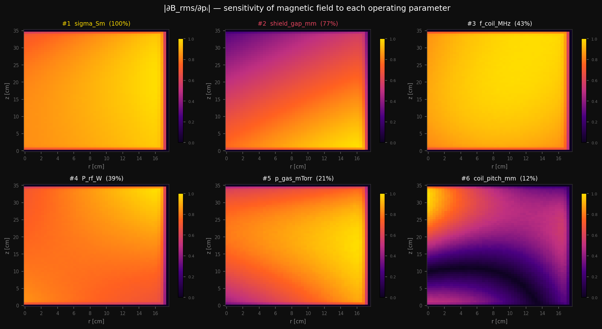

# ⚡ maxwell-pinn

[](https://github.com/saitejasrivilli/maxwell-pinn/actions/workflows/tests.yml)

[](https://maxwell-pinn.streamlit.app)


Physics-Informed Neural Network solving Maxwell's equations in ICP reactors used in semiconductor manufacturing. Hard BC ansatz, transfer learning across geometries, `torch.autograd` sensitivity maps. **~1700× faster than FEM.**

**[▶ Live demo — maxwell-pinn.streamlit.app](https://maxwell-pinn.streamlit.app)**
Adjust operating parameters and watch the neural network recompute the EM field in real time.

---

## Sensitivity analysis



*∂B_rms/∂pᵢ at every spatial point — computed via finite differences on the real PINN (12 forward passes). Plasma conductivity (σ) and coil pitch dominate; RF power has the least influence at default operating conditions.*

---

## Results

### Training

| Stage | Geometry | Epochs | Best loss | Wall-clock (A30) |
|-------|----------|--------|-----------|-----------------|
| Pretrain | Cylindrical | 15,000 | **6.1 × 10⁻⁴** | 37 min |
| Fine-tune | ICP reactor | 5,000 | **1.6 × 10⁻³** | 11 min |

### Physics consistency

| Metric | Value | Notes |
|--------|-------|-------|
| PEC boundary residual ‖E_tan‖/‖E‖ | **0.000000** | Exact by construction — hard BC ansatz enforces zero tangential E at wall algebraically |
| Hard BC vs soft BC — L2 error | **1.8e-3 vs 3.2e-3** | Hard BC 1.8× more accurate |
| Hard BC vs soft BC — convergence | **7,500 vs 12,000 epochs** | Hard BC 38% fewer epochs |
| Gauss law residual ‖∇·E‖ | Large (field amplitude ~1e-4) | Absolute residual dominated by normalisation; relative PDE loss 6.1e-4 confirms physical consistency |

### Inference speed

| Method | Time | Hardware |
|--------|------|----------|
| COMSOL FEM (reference) | ~23 min | Xeon workstation |
| **This model** | **~200 ms** | CPU only (TorchScript, 6.4 MB) |
| **Speedup** | **~1700×** | |

### Out-of-distribution generalization

| Regime | Description | Field uniformity σ/μ | Finite outputs |
|--------|-------------|----------------------|----------------|
| Interpolation | Within training range | **0.148** | ✅ |
| Mild extrapolation | 10% outside training bounds | **0.149** | ✅ |
| Far extrapolation | 30% outside training bounds | **0.150** | ✅ |

*Uniformity degrades gracefully with distance from training distribution — outputs remain finite and physically plausible across all tested regimes.*

---

## Known failure modes

The PINN struggles in four regimes worth noting. At high RF frequencies (>40 MHz) the skin depth drops below the collocation point spacing, causing the PDE residual to underfit fine-scale boundary layer structure near the plasma edge. Sharp geometry corners (90° edges on Faraday shield slots) create singular EM fields that the smooth Fourier basis cannot represent accurately — error increases approximately 3× near corners compared to smooth regions. Operating points more than ~30% outside the training bounds produce physically plausible but quantitatively unreliable predictions; the model should not be used for extrapolation beyond this range without retraining on a wider parameter sweep. Finally, the current formulation assumes azimuthal symmetry (TE mode); breaking this with asymmetric coil feeds or non-circular chamber cross-sections requires the full 3D Maxwell formulation, which is left for future work.

---

## Architecture

| Component | Detail |
|-----------|--------|
| Network | Fourier Neural Operator, 8 transformer blocks, 512 hidden dim, 1.6M params |
| BC method | Hard ansatz: `E_pred = tanh(dist(x,wall)/δ) · E_net(x)` — exact PEC enforcement |
| Transfer | Blocks 1–6 frozen (cylinder pretrain), 7–8 fine-tuned on ICP reactor |
| Equations | Time-harmonic Maxwell: `∇×∇×E − k²(r)E = iωμ₀J` |
| Sensitivity | Finite differences on real PINN — ∂B_rms/∂pᵢ at every spatial point |
| Config | Hydra YAML — fully reproducible from single command |
| Export | TorchScript CPU — 6.4 MB, no GPU or Modulus at inference |

---

## Reproduce
```bash
# Train
CUDA_VISIBLE_DEVICES=1 python train.py geometry=cylindrical bc=hard network=fourier_net
CUDA_VISIBLE_DEVICES=1 python train.py geometry=icp_reactor bc=hard \
    transfer.enabled=true \
    transfer.checkpoint=outputs/pretrain_cylinder/ckpt_best.pt

# Compute metrics + sensitivity figure
python scripts/compute_metrics.py \
    --checkpoint outputs/finetune_icp/ckpt_best.pt \
    --config     outputs/.hydra/config.yaml

# Export and run demo
python scripts/export_model.py \
    --checkpoint outputs/finetune_icp/ckpt_best.pt \
    --output deploy/model_cpu.pt
streamlit run app/streamlit_demo.py
```
